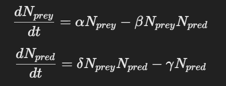
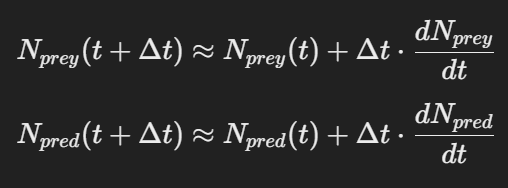

# Ecosystem-model

## Задача
Метою було створення моделі, яка імітує динаміку популяцій жертв і хижаків, відому як модель Лотки-Вольтерри. Ця модель дозволяє досліджувати взаємодію між двома видами: один з яких є здобиччю, а інший - хижаком. Модель враховує розмноження жертв, хижацтво, смертність хижаків і їх розмноження, залежне від кількості жертв.

## Принцип роботи

### Ініціалізація початкових умов:
Користувач вводить початкову кількість жертв і хижаків.
Генеруються випадкові коефіцієнти моделі:
α — коефіцієнт розмноження жертв.
β — коефіцієнт полювання на жертв хижаками.
γ — коефіцієнт смертності хижаків.
δ — коефіцієнт розмноження хижаків за рахунок з'їдання жертв.

### Моделювання динаміки популяцій:
Визначаються функції для обчислення змін популяцій жертв і хижаків.
Генеруються випадкові варіації коефіцієнтів розмноження жертв та смертності хижаків для додання стохастичності моделі.
Використовується метод чисельного інтегрування (метод Ейлера) для розв'язання диференціальних рівнянь, які описують динаміку популяцій.

### Візуалізація результатів:
Створюється анімація за допомогою matplotlib та FuncAnimation, яка ілюструє зміну популяцій жертв і хижаків у часі.
Анімація зупиняється через 30 секунд для запобігання нескінченній роботі.
Використані інструменти
Мова програмування Python — основна мова для написання коду.

### Бібліотеки:
random та numpy — для генерації випадкових чисел і виконання чисельних обчислень.
matplotlib — для візуалізації даних та створення анімації.
FuncAnimation з matplotlib — для створення анімації змін популяцій у часі.

## Диференціальні рівняння:

Модель Лотки-Вольтерри описується наступними диференціальними рівняннями:

N(prey), N(pred) — популяції жертв і хижаків відповідно, 
α — коефіцієнт розмноження жертв, 
β — коефіцієнт полювання хижаками, 
γ — коефіцієнт смертності хижаків, 
δ — коефіцієнт розмноження хижаків.

### Метод Ейлера:

Використовується для чисельного інтегрування диференціальних рівнянь. Метод Ейлера полягає в наближеному обчисленні значень функцій за допомогою крокового переходу:

Δt — малий крок часу
